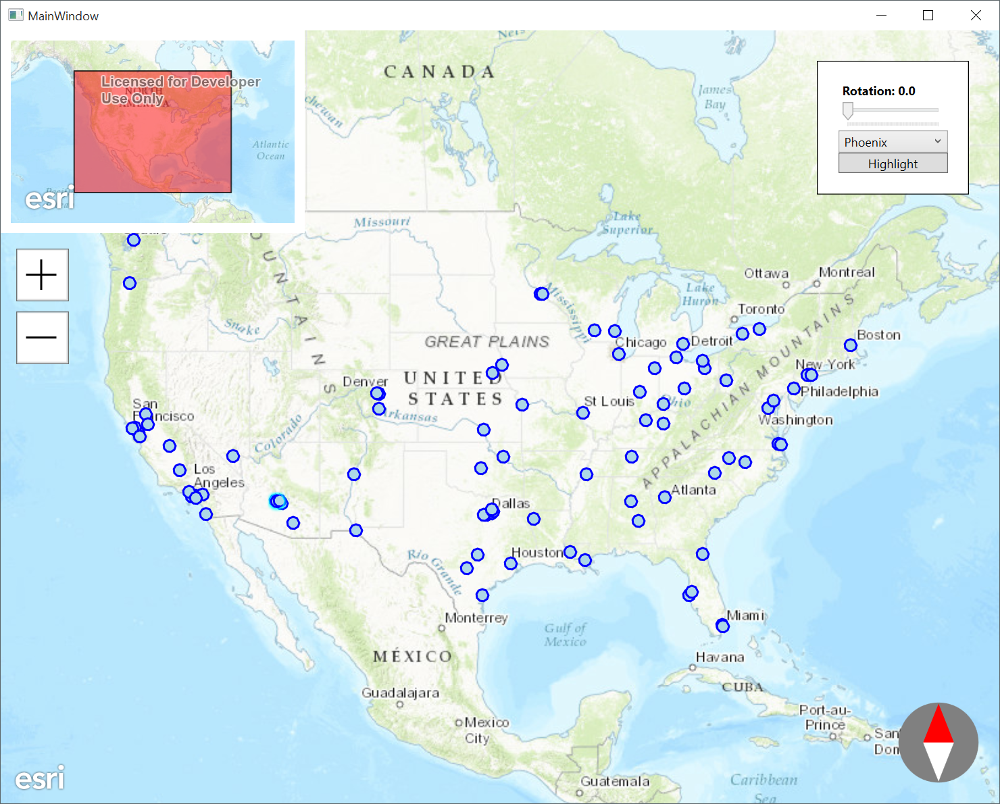

#Building Controls for ArcGIS Runtime for .NET
The ArcGIS Runtime SDK for .NET includes source for Windows Desktop (WPF), Windows Store and Windows Phone APIs that you can use to build mapping and GIS applications. This repository contains examples how to build custom controls using the SDK. 

The contents of the repository *is not* production ready code but instead shows different ways how you can build your own controls. Another good location to find more information how to build controls for the SDK is the official [Toolkit](https://github.com/Esri/arcgis-toolkit-dotnet) repository.

This repository and the controls were used in a **User Presentation** in **Esri's Developer Summit 2016** in Palm Springs as a material.

## Content

* Overview control : shows overview what area is visible in the main MapView
* Compass : shows direction where the north is. Click it to reset rotation.
* Zoom : Zoom in and zoom out buttons
* Highlight animation : Animates highlighting to the selected feature

## Requirements

Supported system configurations for: 
  * [Windows Destkop](http://developers.arcgis.com/net/desktop/guide/system-requirements.htm)
  * [Windows Phone](http://developers.arcgis.com/net/store/guide/system-requirements.htm)
  * [Windows Store](http://developers.arcgis.com/net/store/guide/system-requirements.htm)

Used SDK version is 10.2.7.

## Resources

* [ArcGIS Runtime SDK for .NET](http://esriurl/dotnetsdk)
* [Toolkit for ArcGIS Runtime sDK for .NET](https://github.com/Esri/arcgis-toolkit-dotnet)

## Contributing

Anyone and everyone is welcome to contribute. It's even highly encouraged!
